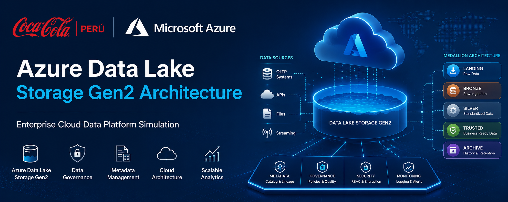
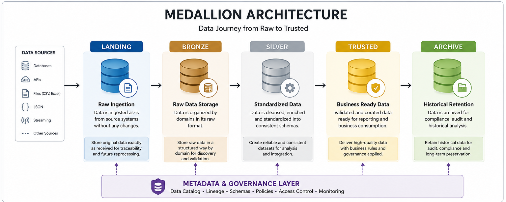
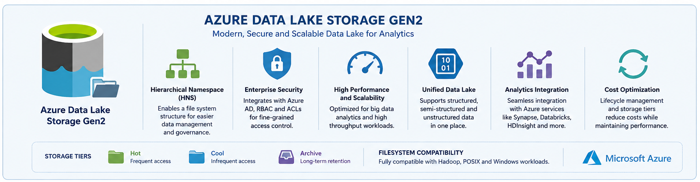

# 🥤 Coca-Cola Perú

# Azure Data Lake Storage Gen2 Architecture

<p align="center">
  
</p>

### Enterprise Cloud Data Platform Simulation

Azure Data Lake Storage Gen2 • Data Governance • Metadata Management • Cloud Architecture


</div>

---

# 📖 Project Overview

This project simulates an **Enterprise Azure Data Lake Storage Gen2 Architecture** inspired by modern cloud data platforms used by multinational organizations such as Coca-Cola.

The architecture is designed following **Lakehouse and Medallion Architecture principles**, allowing data to be organized, governed, and stored efficiently across multiple layers while maintaining scalability, traceability, and data quality.

The solution demonstrates how enterprise data can be managed from its initial ingestion through trusted business-ready datasets while supporting governance, metadata management, and historical retention.

---

# 🏛️ Architecture Used

## Medallion Architecture
<p align="center">
  
</p>
The Data Lake follows the **Medallion Architecture Pattern**, a modern data engineering approach widely adopted in cloud platforms.


### Benefits

✅ Scalability

✅ Data Governance

✅ Data Quality Management

✅ Auditability

✅ Historical Preservation

✅ Enterprise Data Management

---

# ☁️ Technology Stack

| Component         | Technology                     |
| ----------------- | ------------------------------ |
| Cloud Platform    | Microsoft Azure                |
| Storage           | Azure Data Lake Storage Gen2   |
| Namespace         | Hierarchical Namespace (HNS)   |
| Data Organization | Medallion Architecture         |
| Governance        | Metadata Layer                 |
| Data Types        | Structured & Unstructured Data |
| Storage Model     | Data Lake                      |

---

# 🏗️ Arquitectura y Flujo de Datos de la Plataforma Empresarial Coca-Cola Perú
<p align="center">
  
</p>

---

# 🔵 Landing Layer

The Landing Layer stores data exactly as received from source systems.

## Purpose

* Preserve original source data
* Maintain complete traceability
* Enable data lineage
* Support future reprocessing

## Data Sources

* OLTP Databases
* APIs
* CSV Files
* Excel Files
* JSON Files
* External Data Sources

```text
landing/
├── oltp_cocacola_ventas/
├── oltp_cocacola_clientes/
├── oltp_cocacola_productos/
└── external_sources/
```

---

# 🟤 Bronze Layer

The Bronze Layer organizes raw business data by enterprise domains.

## Business Domains

* Sales
* Customers
* Products
* Logistics

```text
bronze/
├── sales/
├── customers/
├── products/
├── logistics/

```

---


# ⚫ Archive Layer

Long-term historical storage used for compliance and auditing.

## Benefits

* Historical preservation
* Regulatory compliance
* Audit support
* Disaster recovery

```text
archive/
```

---

# 🧠 Metadata Layer

Provides governance and management capabilities across the Data Lake.

## Includes

* Data Lineage
* Data Catalog
* Dataset Descriptions
* Schema Definitions
* Source Systems
* Ingestion Timestamps
* Ownership Information

```text
metadata/
```

---

# 📦 Unstructured Data Zone

Stores non-relational enterprise information.

## Examples

* Images
* Videos
* PDFs
* Documents
* Logs
* Multimedia Files

```text
unstructured/
```

---

# 📂 Repository Structure

```text
datalake/
│
├── landing/
│   ├── oltp_cocacola_ventas/
│   ├── oltp_cocacola_clientes/
│   ├── oltp_cocacola_productos/
│   └── external_sources/
│
├── bronze/
│   ├── sales/
│   ├── customers/
│   ├── products/
│   ├── logistics/
├── metadata/
│
├── unstructured/
│
└── archive/
```

---

# 🎯 Project Objective

Design and document an enterprise-scale Azure Data Lake Storage Gen2 architecture demonstrating:

* Data Lake best practices
* Cloud-native storage design
* Data governance principles
* Metadata management
* Domain-driven organization
* Enterprise data lifecycle management

---

# 🚀 Key Features

✔ Azure Data Lake Storage Gen2

✔ Hierarchical Namespace (HNS)

✔ Medallion Architecture

✔ Metadata Management

✔ Data Governance

✔ Structured Data Storage

✔ Unstructured Data Storage

✔ Historical Data Retention

✔ Enterprise Domain Organization

✔ Scalable Cloud Architecture

---


# 👨‍💻 Authors


- Lucas Cocha — Cloud Engineer
- Quispe Sebastian — Data Analyst
- Cristian Huanca — Software Developer


Enterprise Data Engineering Project

Azure Data Lake Storage Gen2 Architecture
